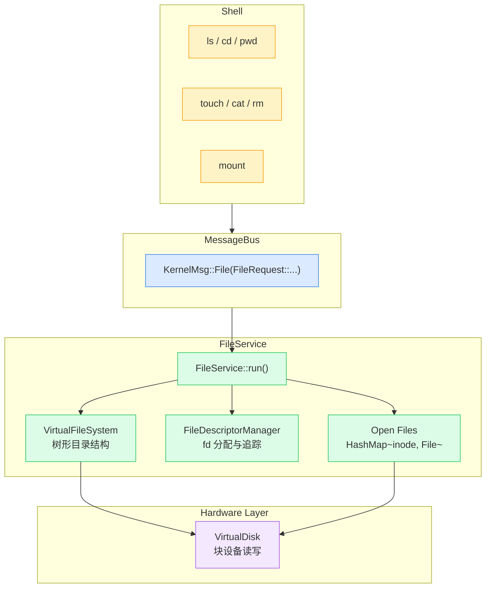
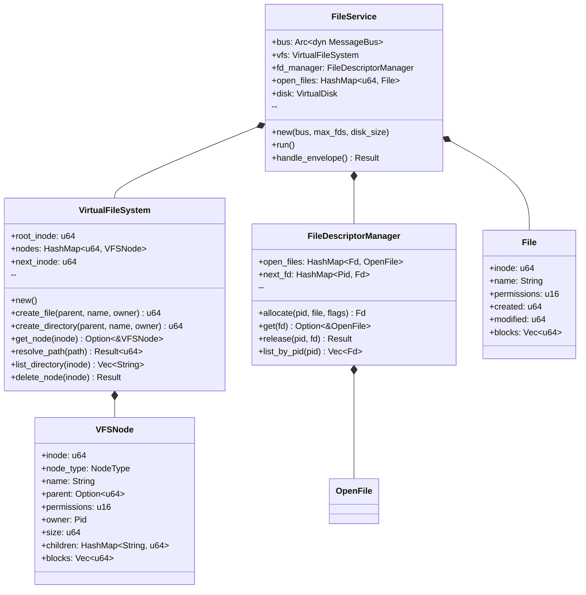
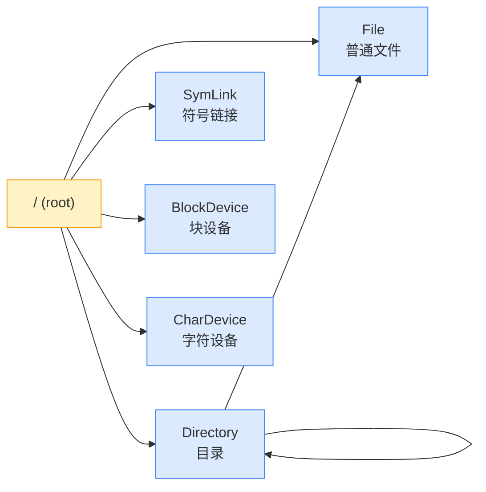

# FileService 设计与实现文档

## 📐 架构概览

FileService 是 genshin-OS 的文件管理服务，负责虚拟文件系统（VFS）、文件描述符管理、
目录操作和文件系统挂载。所有文件操作通过 MessageBus 异步完成。



## 🧩 组件结构



### 📊 模块清单

| 模块 | 文件 | 行数 | 职责 |
|------|------|------|------|
| `VirtualFileSystem` | `vfs.rs` | 547 | 树形目录结构、节点创建/删除/查找、路径解析 |
| `File` / `Directory` | `file.rs` | 496 | 文件实体：元数据、数据块、目录列表 |
| `FileDescriptorManager` | `descriptor.rs` | 519 | 文件描述符：分配、查找、释放、进程追踪 |
| `FileService` | `service.rs` | 782 | 主服务：消息路由、VFS/FD 协调 |

## 🔄 节点类型



## 📨 消息处理

FileService 接收 `KernelMsg::File(FileRequest::...)` 消息，并提供 15+ 种文件操作。

### 完整操作列表

```mermaid
flowchart TD
    accTitle: FileService 消息路由
    accDescr: 展示 FileRequest 的 15 种变体及其在 FileService 中的分发。

    Env["📨 Envelope"] --> F["FileRequest"]

    F --> FOps["文件操作"]
    F --> DOps["目录操作"]
    F --> Mgmt["文件系统管理"]
    F --> Meta["元数据"]

    FOps --> Open["Open → handle_open()"]
    FOps --> Close["Close → handle_close()"]
    FOps --> Read["Read → handle_read()"]
    FOps --> Write["Write → handle_write()"]
    FOps --> Unlink["Unlink → handle_delete()"]

    DOps --> Mkdir["CreateDirectory → handle_mkdir()"]
    DOps --> Rmdir["RemoveDirectory → handle_rmdir()"]
    DOps --> Opendir["OpenDirectory → handle_listdir()"]
    DOps --> Readdir["ReadDirectory"]
    DOps --> Closedir["CloseDirectory"]

    Mgmt --> Mount["Mount"]
    Mgmt --> Umount["Unmount"]
    Mgmt --> Sync["Sync"]

    Meta --> Stat["Stat → handle_stat()"]
    Meta --> Chmod["Chmod"]
    Meta --> Chown["Chown"]

    classDef file fill:#dbeafe,stroke:#3b82f6
    classDef dir fill:#dcfce7,stroke:#22c55e
    classDef mgmt fill:#fef3c7,stroke:#f59e0b
    classDef meta fill:#f3e8ff,stroke:#a855f7

    class Open,Close,Read,Write,Unlink file
    class Mkdir,Rmdir,Opendir,Readdir,Closedir dir
    class Mount,Umount,Sync mgmt
    class Stat,Chmod,Chown meta
```



### API 参考

#### 文件操作

| 消息变体 | 参数 | 说明 |
|---------|------|------|
| `Open` | `path, flags: OpenFlags` | 打开/创建文件 |
| `Close` | `fd` | 关闭文件描述符 |
| `Read` | `fd, offset, buf, size` | 从文件读取 |
| `Write` | `fd, offset, buf, size` | 写入文件 |
| `Unlink` | `path` | 删除文件 |

`OpenFlags` 支持以下组合：

| 工厂方法 | read | write | create | 说明 |
|---------|:---:|:---:|:---:|------|
| `read_only()` | ✅ | ❌ | ❌ | 只读打开 |
| `write_only()` | ❌ | ✅ | ❌ | 只写打开 |
| `read_write()` | ✅ | ✅ | ❌ | 读写打开 |
| `create()` | ❌ | ✅ | ✅ | 创建新文件 |

#### 目录操作

| 消息变体 | 参数 | 说明 |
|---------|------|------|
| `CreateDirectory` | `path` | 创建目录 |
| `RemoveDirectory` | `path` | 删除空目录 |
| `OpenDirectory` | `path` | 列出目录内容 |
| `ReadDirectory` | `dir_fd` | 读取目录项 |
| `CloseDirectory` | `dir_fd` | 关闭目录 |

#### 文件系统管理

| 消息变体 | 参数 | 说明 |
|---------|------|------|
| `Mount` | `device_id, mount_point, fs_type` | 挂载文件系统 |
| `Unmount` | `mount_point` | 卸载文件系统 |
| `Sync` | — | 同步缓冲区 |

#### 文件元数据

| 消息变体 | 参数 | 说明 |
|---------|------|------|
| `Stat` | `path` | 获取文件属性 |
| `Chmod` | `path, mode` | 修改权限 |
| `Chown` | `path, uid, gid` | 修改所有者 |
| `Seek` | `fd, offset, whence` | 调整文件偏移 |
| `Tell` | `fd` | 获取当前偏移 |

`SeekWhence` 支持：
- `Set (0)` — 从文件开头
- `Cur (1)` — 从当前位置
- `End (2)` — 从文件末尾

## 📂 VFS 数据结构

```mermaid
flowchart TD
    accTitle: VFS 目录树结构
    accDescr: 展示 VFS 的树形目录结构：根节点 (/) 下有多个子节点，每个节点可以是文件或目录。

    Root["inode=0<br/>name=\"/\"<br/>type=Directory<br/>children={\"docs\":1,\"home\":2}"]

    Docs["inode=1<br/>name=\"docs\"<br/>type=Directory<br/>parent=0<br/>children={}"]

    Home["inode=2<br/>name=\"home\"<br/>type=Directory<br/>parent=0<br/>children={\"readme\":3}"]

    Readme["inode=3<br/>name=\"readme\"<br/>type=File<br/>parent=2<br/>size=1024<br/>blocks=[100]"]

    Root --> Docs
    Root --> Home
    Home --> Readme

    classDef dir fill:#dbeafe,stroke:#3b82f6
    classDef file fill:#dcfce7,stroke:#22c55e

    class Root,Docs,Home dir
    class Readme file
```

### VFSNode 结构

```rust
pub struct VFSNode {
    pub inode: u64,              // 节点 ID (inode 号)
    pub node_type: NodeType,     // 节点类型
    pub name: String,            // 节点名称
    pub parent: Option<u64>,     // 父目录 inode
    pub permissions: u16,        // Unix 权限位
    pub owner: Pid,              // 所有者 PID
    pub size: u64,               // 文件大小
    pub created: u64,            // 创建时间
    pub modified: u64,           // 修改时间
    pub blocks: Vec<u64>,        // 数据块索引 (文件)
    pub children: HashMap<String, u64>, // 子节点 (目录)
    pub ref_count: u32,          // 引用计数
}
```

## 🔌 Shell 命令映射

通过 MessageBus 路由到 FileService 的 Shell 命令：

| Shell 命令 | FileRequest 变体 | 说明 |
|-----------|-----------------|------|
| `touch <file>` | `Open { path, flags: create }` | 创建文件 |
| `cat <file>` | `Read { fd, offset, buf, size }` | 读取文件 |
| `rm <file>` | `Unlink { path }` | 删除文件 |
| `mkdir <dir>` | `CreateDirectory { path }` | 创建目录 |
| `stat <file>` | `Stat { path }` | 查看元数据 |
| `mount <dev> <path> [fs]` | `Mount { device_id, mount_point, fs_type }` | 挂载文件系统 |

## 🔧 接入方式

```rust
use genshin_os::services::file::FileService;

let bus: Arc<dyn MessageBus> = Arc::new(LockedBus::new());
let file_bus = bus.clone();

thread::spawn(move || {
    let service = FileService::new(file_bus, 256, 1024 * 1024);
    // max_fds_per_process=256, disk_size=1MB
    service.run();
});
```

## 🧪 测试覆盖

```
VFS 单元测试:          13 tests  ✅
File/Directory 单元测试: 14 tests  ✅
FileDescriptor 单元测试:  11 tests  ✅
FileService 集成测试:      4 tests  ✅
Shell filesystem 测试:    12 tests  ✅
─────────────────────────────────
合计:                     54 tests
```

| 测试类别 | 覆盖场景 |
|---------|---------|
| VFS | 创建/删除文件, 创建/删除目录, 路径解析, 目录列表, 节点查找 |
| File | 文件创建, 权限, 读写, 时间戳 |
| Descriptor | FD 分配/释放, 多进程隔离, 进程间不干扰 |
| Service | Open/Close/Read/Write/Stat/Unlink/Mkdir 全流程 |

## 📝 Shell 交互演示

```bash
cargo run
```

```
chao-os> mkdir /docs          # → FileService CreateDirectory
chao-os> touch /hello.txt     # → FileService Open(create)
chao-os> stat /docs           # → FileService Stat
chao-os> ls /                 # (Shell 内置 VFS)
chao-os> mount 0 /mnt simple  # → FileService Mount
```

或运行自动化演示：

```bash
cargo run --example file_demo
```
