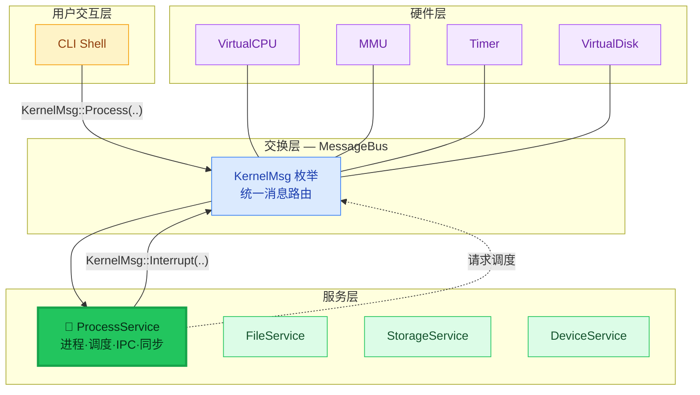
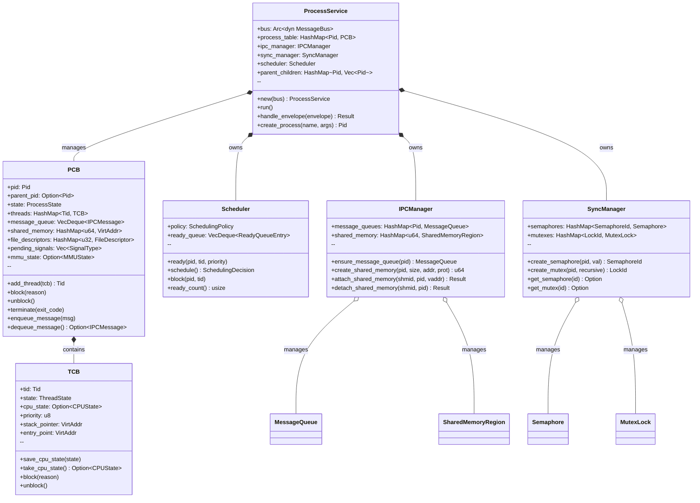
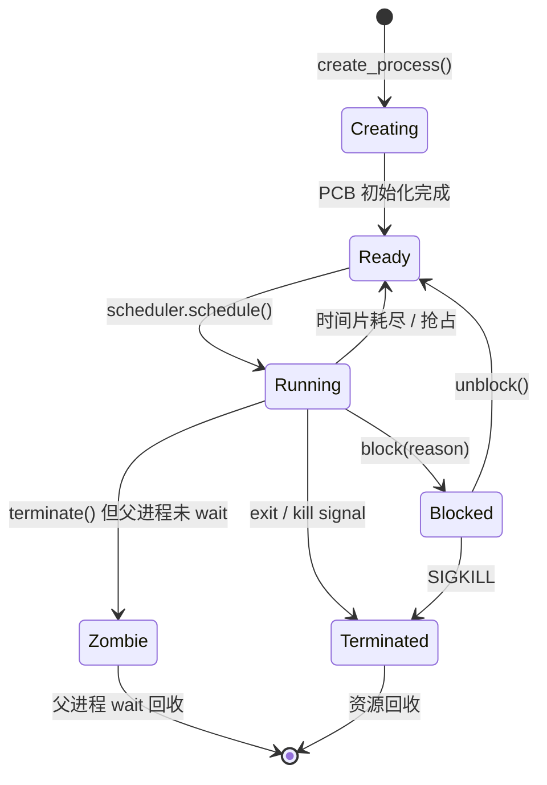
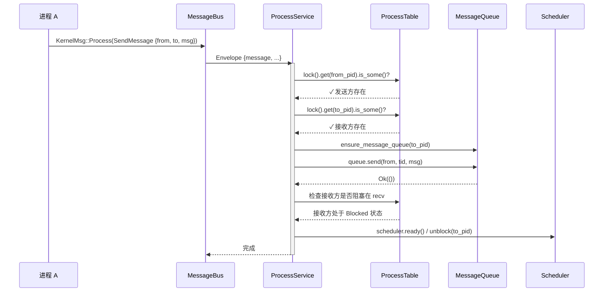
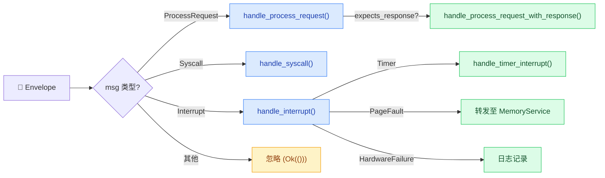
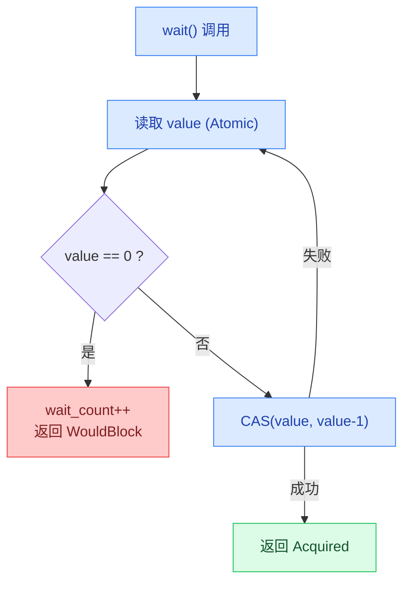
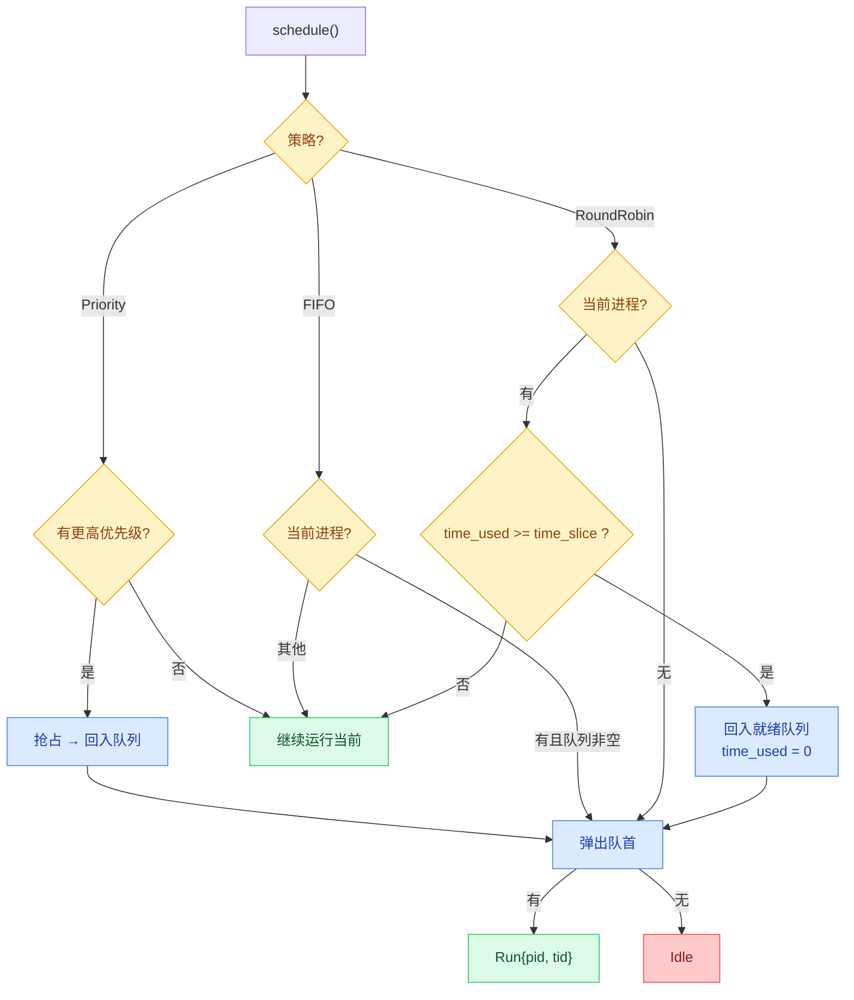
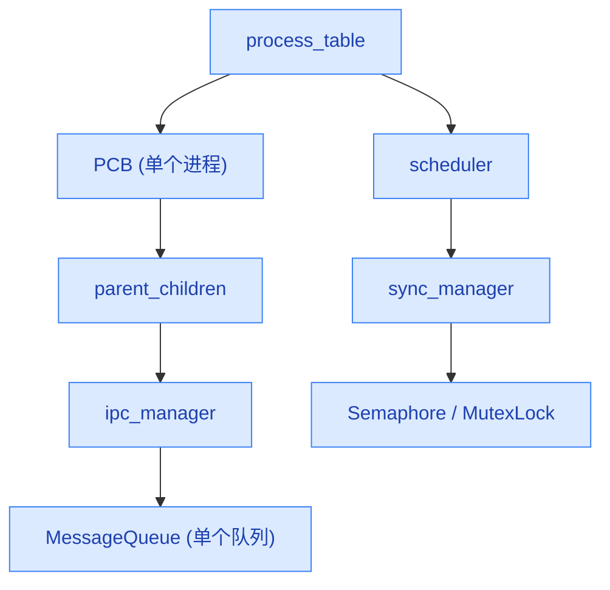

# ProcessService 设计与实现文档

## 📐 架构概览

ProcessService 是 genshin-OS 微内核的进程管理服务，运行在 Service Layer，通过 MessageBus
与硬件层、其他服务层通信。它负责进程生命周期管理、线程调度、IPC 通信和同步原语。



## 🧩 组件结构

ProcessService 由五个子模块组成，各司其职：



### 📊 模块职责

| 模块 | 文件 | 行数 | 职责 |
|------|------|------|------|
| `PCB` / `TCB` | `pcb.rs` | 788 | 进程/线程控制块：状态管理、文件描述符、信号队列 |
| `Scheduler` | `scheduler.rs` | 589 | 调度器：支持 FIFO、Round Robin、Priority 三种策略 |
| `IPCManager` | `ipc.rs` | 677 | 进程间通信：消息队列、共享内存区域管理 |
| `SyncManager` | `sync.rs` | 730 | 同步原语：信号量（原子操作）、互斥锁（支持递归） |
| `ProcessService` | `service.rs` | 1257 | 主服务：消息分发、进程生命周期、IPC/Sync 协调 |

## 🔄 进程生命周期



**状态说明**：

| 状态 | 含义 | 触发条件 |
|------|------|---------|
| `Creating` | 进程正在创建 | `create_process()` 被调用 |
| `Ready` | 就绪，等待调度 | 创建完成或从阻塞恢复 |
| `Running` | 当前正在 CPU 执行 | 调度器选中 |
| `Blocked(reason)` | 阻塞等待 | I/O、锁、信号量、sleep、waitpid |
| `Terminated` | 正常终止 | `exit()` 或 SIGTERM |
| `Zombie` | 已终止但未被回收 | 父进程尚未调用 `wait()` |

## 📨 消息处理流程

ProcessService 接收三类 `KernelMsg` 变体：`Process`、`Syscall`、`Interrupt`。



### 完整的消息路由表

ProcessService 的 `handle_envelope()` 根据消息类型进行分发：



## 📋 ProcessRequest 消息全集

ProcessService 支持以下全部消息类型。所有消息通过 `KernelMsg::Process(ProcessRequest::...)` 发送。

### 🔀 调度相关

| 消息变体 | 参数 | 说明 |
|---------|------|------|
| `Schedule` | `pid: Pid, tid: Tid` | 将进程/线程加入就绪队列 |
| `Block` | `pid, tid, reason: BlockReason` | 阻塞进程/线程 |
| `Unblock` | `pid, tid` | 解除阻塞 |
| `QueryState` | `pid` | 查询进程状态 |
| `ContextSwitch` | `from_pid, to_pid` | 上下文切换请求 |

### 📮 IPC — 消息传递

| 消息变体 | 参数 | 说明 |
|---------|------|------|
| `SendMessage` | `from_pid, to_pid, msg: IPCMessage` | 发送消息至目标进程邮箱 |
| `ReceiveMessage` | `pid, blocking: bool` | 接收消息（可选阻塞） |
| `PeekMessage` | `pid` | 查看但不取出队首消息 |

IPCMessage 支持六种负载类型：

| 负载类型 | 说明 |
|---------|------|
| `Text { data: String }` | 文本消息 |
| `Binary { addr, size }` | 二进制数据（发送方地址空间） |
| `PassFd { fd: u32 }` | 文件描述符传递 |
| `SharedMemory { shmid: u64 }` | 共享内存通知 |
| `Signal { signal: SignalType }` | 信号通知 |
| `Control { cmd, args }` | 控制命令 |

### 🧠 IPC — 共享内存

| 消息变体 | 参数 | 说明 |
|---------|------|------|
| `CreateSharedMemory` | `pid, size, prot: MemProt` | 创建共享内存区域 |
| `AttachSharedMemory` | `pid, shmid` | 映射共享内存到进程地址空间 |
| `DetachSharedMemory` | `pid, shmid` | 解除映射 |

共享内存生命周期：

```mermaid
flowchart LR
    accTitle: 共享内存生命周期
    accDescr: 展示共享内存从创建、附着、使用到标记删除和最终清理的流程。

    A["CreateShm"] --> B["Attach (pid1)"]
    B --> C["Attach (pid2)"]
    C --> D["使用中<br/>ref_count > 0"]
    D --> E["Detach (pid1)"]
    E --> F["ref_count = 1"]
    F --> G["MarkForDeletion"]
    G --> H["Detach (pid2)"]
    H --> I["ref_count = 0<br/>→ 清理"]

    classDef create fill:#dcfce7,stroke:#22c55e,color:#14532d
    classDef active fill:#dbeafe,stroke:#3b82f6,color:#1e40af
    classDef destroy fill:#fecaca,stroke:#ef4444,color:#7f1d1d

    class A,B,C create
    class D,E,F active
    class G,H,I destroy
```



### 🔒 IPC — 同步原语

| 消息变体 | 参数 | 说明 |
|---------|------|------|
| `CreateSemaphore` | `pid, initial_value: u32` | 创建信号量 |
| `WaitSemaphore` | `pid, semid` | P 操作（可能阻塞） |
| `SignalSemaphore` | `pid, semid` | V 操作 |
| `CreateLock` | `pid` | 创建互斥锁 |
| `AcquireLock` | `pid, lock_id` | 获取锁（可能阻塞） |
| `ReleaseLock` | `pid, lock_id` | 释放锁 |

Semaphore 使用 `AtomicU32` 实现无锁 CAS 操作：



### 🧬 进程生命周期

| 消息变体 | 参数 | 说明 |
|---------|------|------|
| `ForkProcess` | `parent_pid` | 复制父进程创建子进程 |
| `ExecProcess` | `pid, executable, args` | 替换进程映像 |
| `WaitChild` | `pid, child_pid: Option<Pid>` | 等待子进程退出 |
| `Signal` | `pid, signal: SignalType` | 向进程发送信号 |
| `GetProcessInfo` | `pid` | 查询进程详情 |
| `ListProcesses` | — | 列出所有进程 |

支持的信号类型：

| 信号 | 值 | 行为 |
|------|----|------|
| `SIGTERM` | 15 | 终止进程（可捕获） |
| `SIGKILL` | 9 | 立即终止（不可捕获） |
| `SIGSTOP` | 19 | 暂停进程 |
| `SIGCONT` | 18 | 继续运行 |
| `SIGUSR1` | 10 | 用户自定义 |
| `SIGUSR2` | 12 | 用户自定义 |
| `SIGALRM` | 14 | 定时器超时 |
| `SIGCHLD` | 17 | 子进程状态变更 |
| `SIGSEGV` | 11 | 段错误 |
| `SIGILL` | 4 | 非法指令 |
| `SIGFPE` | 8 | 浮点异常 |

### Syscall 处理

| 变体 | 参数 | 说明 |
|------|------|------|
| `CreateProcess` | `executable, args` | 从可执行文件创建新进程 |
| `ExitProcess` | `exit_code` | 退出当前进程 |
| `CreateThread` | `entry_point` | 创建新线程 |
| `Read` | `fd, buf, size` | 读文件描述符 |
| `Write` | `fd, buf, size` | 写文件描述符 |
| `Mmap` | `size, prot` | 内存映射 |
| `Munmap` | `addr, size` | 解除内存映射 |

## ⏱️ 调度器设计



### 调度策略对比

| 策略 | Preemptive | 时间片 | 饥饿风险 | 适用场景 |
|------|:---:|:---:|:---:|------|
| FIFO | ❌ | 无 | 高（长进程阻塞短进程） | 批处理 |
| Round Robin | ✅ | 可配置（默认10） | 无 | 交互式系统 |
| Priority | ✅ | 无 | 低优先级可能饥饿 | 实时系统 |
| SJF | ❌ | 无 | 长作业可能饥饿 | 批处理（已知执行时间） |
| MLFQ | ✅ | 多级 | 低 | 通用系统（未来实现） |

## 🔧 线程安全设计

所有共享状态都通过 `Arc<Mutex<T>>` 保护，使用统一的 `lock_mutex` 辅助函数：

```rust
fn lock_mutex<T>(mutex: &Mutex<T>) -> GenshinResult<MutexGuard<T>> {
    mutex.lock().map_err(|e| GenshinError::Service(ServiceError::InvalidArguments {
        param: "mutex".to_string(),
        reason: format!("Mutex poisoned: {}", e),
    }))
}
```

**锁层级**（按获取顺序，避免死锁）：



> **注意**：`scheduler` 和 `process_table` 是同一层级，不可嵌套互锁。之前 `handle_schedule` 中存在的双重锁 `scheduler` 已在修复中消除。

## 🧪 测试覆盖

```
ProcessService 集成测试:  17 tests  ✅
PCB/TCB 单元测试:         13 tests  ✅
IPC 单元测试:             10 tests  ✅
Sync 单元测试:            12 tests  ✅
Scheduler 单元测试:       12 tests  ✅
─────────────────────────────────
合计:                     64 tests
```

测试覆盖的核心场景：

| 测试类别 | 覆盖场景 |
|---------|---------|
| 进程创建/终止 | `create_process`, `fork`, `exec`, `exit` |
| 调度 | schedule、block/unblock、context switch、timer interrupt |
| IPC 消息 | send、receive（阻塞/非阻塞）、peek、队列容量 |
| 共享内存 | create、attach、detach、ref_count、延迟删除 |
| 同步 | semaphore wait/signal/overflow/reset、mutex acquire/release/recursive/deadlock |
| 信号 | SIGTERM、SIGSTOP、SIGCONT 状态转换 |

## 🔌 接入方式

在 `main.rs` 中作为后台线程启动：

```rust
use genshin_os::services::process::ProcessService;

let bus = Arc::new(LockedBus::new());
let process_bus = bus.clone();

thread::spawn(move || {
    let service = ProcessService::new(process_bus);
    service.run(); // 无限循环：接收 Envelope → 处理消息
});
```

服务启动后自动订阅 MessageBus，持续处理 `KernelMsg::Process`、`KernelMsg::Syscall` 和 `KernelMsg::Interrupt` 消息。
