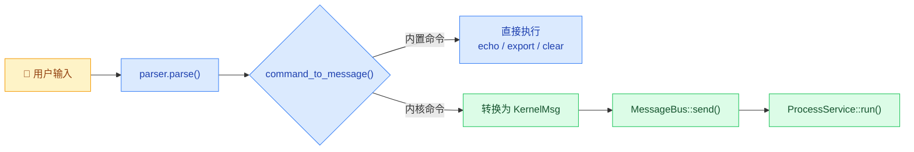
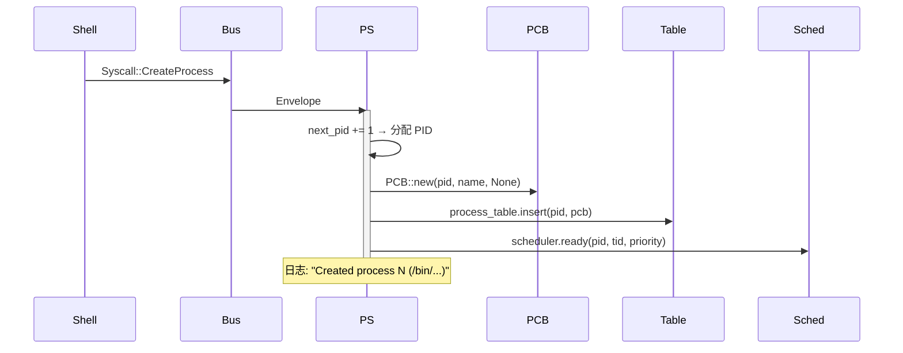
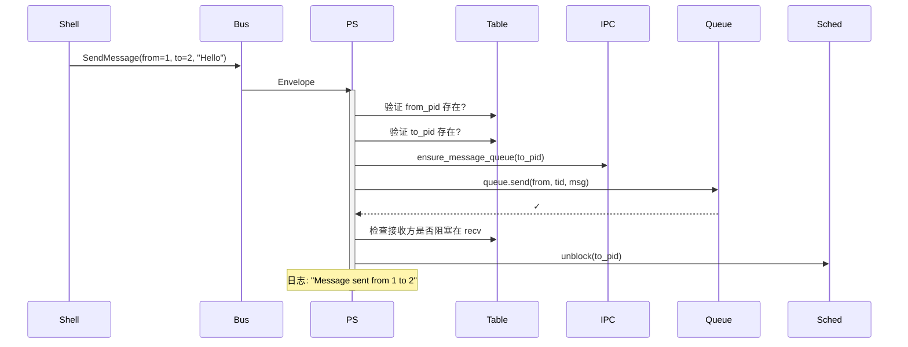
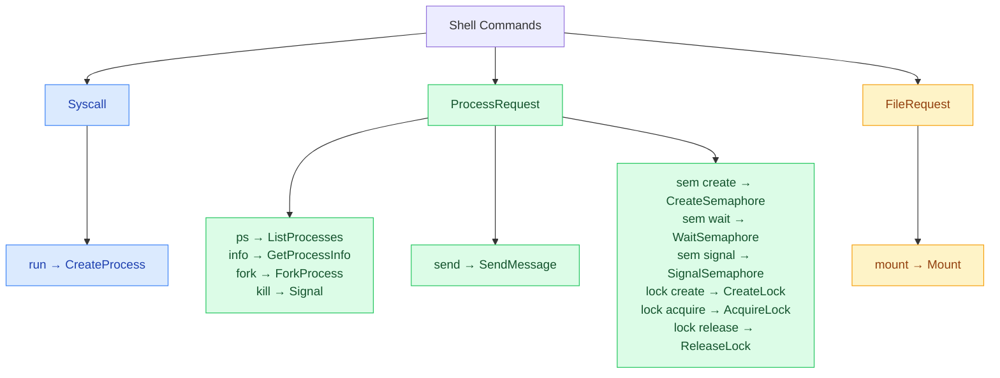

# Shell 命令参考

## 🎯 概述

Chao-OS Shell 提供交互式命令行界面，所有进程操作通过 MessageBus 以 `KernelMsg` 消息异步发送至 `ProcessService` 处理。

### 命令执行流程



---

## 📋 内置命令

内置命令在 Shell 内部直接处理，不通过 MessageBus。

| 命令 | 参数 | 说明 |
|------|------|------|
| `echo <text>` | 任意文本 | 打印文本到标准输出 |
| `export KEY=VALUE` | 变量名=值 | 设置环境变量 |
| `unset KEY` | 变量名 | 删除环境变量 |
| `env` | 无 | 列出所有环境变量 |
| `set` | 无 | 显示 Shell 设置 |
| `clear` | 无 | 清屏 |
| `history` | 无 | 显示命令历史 |
| `alias name=cmd` | 别名定义 | 创建命令别名 |
| `unalias name` | 别名 | 删除别名 |
| `true` | 无 | 总是返回成功 |
| `false` | 无 | 总是返回失败 |
| `:` | 无 | 空命令（no-op） |

### 文件系统命令

| 命令 | 参数 | 说明 |
|------|------|------|
| `ls [path]` | 路径（可选） | 列出目录内容 |
| `cd <path>` | 目标路径 | 切换工作目录 |
| `pwd` | 无 | 打印当前目录 |
| `mkdir <dir>` | 目录名 | 创建目录 |
| `mount <dev> <path> [fs]` | 设备ID + 挂载点 + FS类型 | 挂载文件系统 |

### 系统命令

| 命令 | 参数 | 说明 |
|------|------|------|
| `help` | 无 | 显示帮助信息 |
| `exit` / `quit` | 无 | 退出 Shell |

---

## 🧬 进程管理命令

进程命令通过 **MessageBus** 发送 `KernelMsg::Process(ProcessRequest::...)` 或 `KernelMsg::Syscall(Syscall::...)` 至后台 `ProcessService`。

### `run` — 创建进程

```
run <executable> [args...]
```

| 字段 | 类型 | 说明 |
|------|------|------|
| `executable` | String | 可执行文件路径 |
| `args` | Vec\<String\> | 命令行参数（可选） |

**对应的 KernelMsg**:
```rust
KernelMsg::Syscall(Syscall::CreateProcess {
    executable: "/bin/init".to_string(),
    args: vec!["--daemon".to_string()],
})
```

**执行流程**:


**用法示例**:
```bash
chao-os> run /bin/init --daemon
chao-os> run /bin/shell --interactive
chao-os> run /bin/worker --pool-size=4
```

**输出**: `ProcessService: Created process 1 (/bin/init)`

---

### `ps` — 列出进程

```
ps
```

无参数。

**对应的 KernelMsg**:
```rust
KernelMsg::Process(ProcessRequest::ListProcesses)
```

**用法示例**:
```bash
chao-os> ps
```

**输出**:
```
ProcessService: Process list:
  PID 2
  PID 1
  PID 3
```

---

### `info` — 查看进程详情

```
info <pid>
```

| 字段 | 类型 | 说明 |
|------|------|------|
| `pid` | u64 | 进程 ID |

**对应的 KernelMsg**:
```rust
KernelMsg::Process(ProcessRequest::GetProcessInfo { pid })
```

**用法示例**:
```bash
chao-os> info 1
```

**输出**:
```
ProcessService: Process 1 info:
  Executable: /bin/init
  State: Creating
  Threads: 0
  Parent: None
```

---

### `fork` — Fork 子进程

```
fork <parent_pid>
```

| 字段 | 类型 | 说明 |
|------|------|------|
| `parent_pid` | u64 | 父进程 PID |

**对应的 KernelMsg**:
```rust
KernelMsg::Process(ProcessRequest::ForkProcess { parent_pid })
```

**执行流程**: 复制父进程 PCB → 分配新 PID → 建立父子关系 → 加入调度器。

**用法示例**:
```bash
chao-os> fork 1
```

**输出**: `ProcessService: Forked 1 -> 4`

---

### `kill` — 发送信号

```
kill <pid> [signal]
```

| 字段 | 类型 | 说明 |
|------|------|------|
| `pid` | u64 | 目标进程 PID |
| `signal` | String（可选） | 信号名，默认 `term` |

**对应的 KernelMsg**:
```rust
KernelMsg::Process(ProcessRequest::Signal { pid, signal })
```

**支持的信号**:

| 参数值 | 信号 | 枚举 | 行为 |
|--------|------|------|------|
| `term` / `sigterm` | SIGTERM | `SignalType::Terminate` | 终止进程（可捕获） |
| `kill` / `sigkill` | SIGKILL | `SignalType::Kill` | 立即终止（不可捕获） |
| `stop` / `sigstop` | SIGSTOP | `SignalType::Stop` | 暂停进程 |
| `cont` / `sigcont` | SIGCONT | `SignalType::Continue` | 继续运行 |
| `usr1` | SIGUSR1 | `SignalType::User1` | 用户自定义信号 1 |
| `usr2` | SIGUSR2 | `SignalType::User2` | 用户自定义信号 2 |

**用法示例**:
```bash
chao-os> kill 3 stop        # 暂停 PID=3
chao-os> kill 3 cont        # 恢复 PID=3
chao-os> kill 3 term        # 终止 PID=3
chao-os> kill 3 kill        # 强杀 PID=3
```

---

## 📮 IPC 通信命令

### `send` — 发送消息

```
send <from_pid> <to_pid> <message>
```

| 字段 | 类型 | 说明 |
|------|------|------|
| `from_pid` | u64 | 发送方 PID |
| `to_pid` | u64 | 接收方 PID |
| `message` | String | 消息文本 |

**对应的 KernelMsg**:
```rust
KernelMsg::Process(ProcessRequest::SendMessage {
    from_pid,
    to_pid,
    msg: IPCMessage::Text { data: message },
})
```



**用法示例**:
```bash
chao-os> run /bin/sender
chao-os> run /bin/receiver
chao-os> send 1 2 "Hello from PID 1!"
chao-os> send 1 2 "Shared data: 0xDEADBEEF"
```

**输出**:
```
ProcessService: Message sent from 1 to 2
```

> **注意**: 接收方需要主动调用 `ReceiveMessage` 才能取出消息。目前 Shell 没有 `recv` 命令，消息接收通过代码演示 `examples/process_demo.rs` 展示。

---

## 🔒 同步原语命令

### `sem` — 信号量操作

```
sem create <pid> [initial_value]
sem wait   <pid> <semid>
sem signal <pid> <semid>
```

| 子命令 | 参数 | 说明 |
|--------|------|------|
| `create` | pid, initial_value | 创建信号量，初始值默认 1 |
| `wait` | pid, semid | P 操作（减 1），值为 0 时阻塞 |
| `signal` | pid, semid | V 操作（加 1），可能唤醒等待者 |

**对应的 KernelMsg**:
```rust
// Create
KernelMsg::Process(ProcessRequest::CreateSemaphore { pid, initial_value })

// Wait (P)
KernelMsg::Process(ProcessRequest::WaitSemaphore { pid, semid })

// Signal (V)
KernelMsg::Process(ProcessRequest::SignalSemaphore { pid, semid })
```

**实现细节**: 使用 `AtomicU32::compare_exchange_weak()` 实现无锁 CAS 操作。

**用法示例**:
```bash
chao-os> sem create 1 2      # 创建信号量，初值=2
chao-os> sem wait 1 1         # PID=1 执行 P 操作 → Acquired
chao-os> sem wait 2 1         # PID=2 执行 P 操作 → Acquired
chao-os> sem wait 3 1         # PID=3 执行 P 操作 → WouldBlock（值已为 0）
chao-os> sem signal 1 1       # PID=1 执行 V 操作 → Released
```

---

### `lock` — 互斥锁操作

```
lock create  <pid>
lock acquire <pid> <lock_id>
lock release <pid> <lock_id>
```

| 子命令 | 参数 | 说明 |
|--------|------|------|
| `create` | pid | 创建互斥锁 |
| `acquire` | pid, lock_id | 获取锁，已被占用则阻塞 |
| `release` | pid, lock_id | 释放锁，非持有者释放返回 NotOwner |

**对应的 KernelMsg**:
```rust
KernelMsg::Process(ProcessRequest::CreateLock { pid })
KernelMsg::Process(ProcessRequest::AcquireLock { pid, lock_id })
KernelMsg::Process(ProcessRequest::ReleaseLock { pid, lock_id })
```

**实现细节**: 支持递归锁（同一进程可多次 acquire，需等量 release）。

**用法示例**:
```bash
chao-os> lock create 1        # PID=1 创建锁 → lock_id=1
chao-os> lock acquire 1 1     # PID=1 获取 → Acquired
chao-os> lock acquire 2 1     # PID=2 尝试获取 → WouldBlock（PID=1 持有）
chao-os> lock release 1 1     # PID=1 释放 → Released
chao-os> lock release 2 1     # PID=2 尝试释放 → NotOwner
```

---

## 🔗 命令与 KernelMsg 完整映射



---

## 🧪 演示脚本

完整功能演示可通过以下命令运行：

```bash
cargo run --example process_demo
```

该脚本自动执行进程创建、IPC 消息传递、共享内存、信号量、互斥锁、信号、调度器共 10 个核心功能。

---

## 📝 添加新命令

在 `src/ui/shell/mod.rs` 的 `command_to_message()` 函数中添加新的 match 分支：

```rust
"mycmd" => {
    let arg = command.args.get(0)?;
    Some(KernelMsg::Process(ProcessRequest::SomeVariant {
        field: arg.parse().ok()?,
    }))
}
```

同时更新 `show_help()` 函数添加帮助文本。
